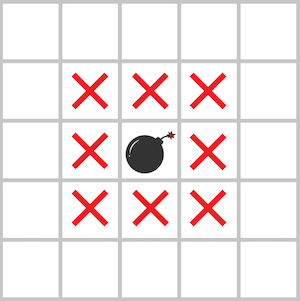

## 출처

<br>

[코딩테스트 연습 - 안전지대](https://school.programmers.co.kr/learn/courses/30/lessons/120866)

<br>

## 문제 설명

<br>

다음 그림과 같이 지뢰가 있는 지역과 지뢰에 인접한 위, 아래, 좌, 우 대각선 칸을 모두 위험지역으로 분류합니다.



지뢰는 2차원 배열 `board`에 1로 표시되어 있고 `board`에는 지뢰가 매설 된 지역 1과, 지뢰가 없는 지역 0만 존재합니다.
지뢰가 매설된 지역의 지도 `board`가 매개변수로 주어질 때, 안전한 지역의 칸 수를 return하도록 solution 함수를 완성해주세요.

<br>

## 제한사항

<br>

- `board`는 n * n 배열입니다.
- 1 ≤ n ≤ 100
- 지뢰는 1로 표시되어 있습니다.
- `board`에는 지뢰가 있는 지역 1과 지뢰가 없는 지역 0만 존재합니다.

<br>

## 풀이 전략

<br>
 
1. 주어진 배열의 `1` 값을 찾는다.
2. `1` 값의 주변에 `2` 값을 씌워준다.
3. 배열의 `0`의 수를 센다.

<br>

## Code

<br>

```cs
using System;

public class Solution
{
    public int solution(int[,] board)
    {
        int answer = 0;
        int boardLength = board.GetLength(0);

        for (int i = 0; i < boardLength; i++)
        {
            for (int j = 0; j < boardLength; j++)
            {
                if (board[i, j] == 1)
                {
                    SetBombArea(board, i, j);
                }
            }
        }

        for (int i = 0; i < boardLength; i++)
        {
            for (int j = 0; j < boardLength; j++)
            {
                if (board[i, j] == 0)
                {
                    answer++;
                }
            }
        }

        return answer;
    }

    private void SetBombArea(int[,] board, int x, int y)
    {
        for (int i = x - 1; i <= x + 1; i++)
        {
            for (int j = y - 1; j <= y + 1; j++)
            {
                SetFlag(board, i, j);
            }
        }
    }

    private void SetFlag(int[,] board, int x, int y)
    {
        try
        {
            if (board[x, y] != 1)
            {
                board[x, y] = 2;
            }
        }
        catch
        { }
    }
}
```

<br>

## 참조 자료

<br>

- [Array.GetLength(Int32) Method](https://learn.microsoft.com/ko-kr/dotnet/api/system.array.getlength?view=net-8.0)