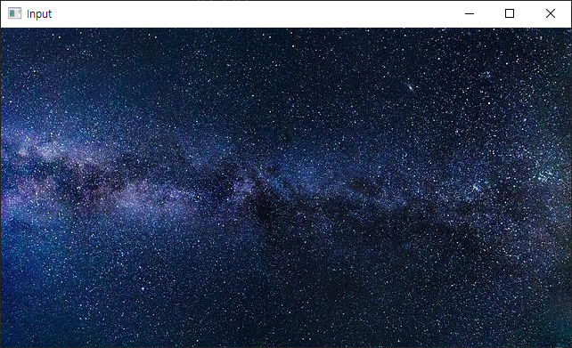
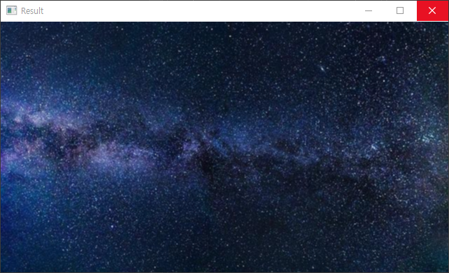

<h1 id="title">C# - OpenCVSharp4 - Image Filtering</h1>

<h2 id="intro">Introduction</h2>

1. `OpenCV`에서 제공하는 filter를 이용해 필터 또는 샤프닝 효과를 얻을 수 있다.
2. `Filter2D()`, `BoxFilter()` 등 여러 method를 상황에 따라 사용한다.
3. 수행 결과와 예시 코드는 아래 참조

<br><br>

<h2 id="result">수행 결과 확인</h2>

1. Original<br><br><br>
2. Filter2D<br><br><br>
3. BoxFilter<br><br><br>
4. GaussianBlur<br><br><br>
5. MedianBlur<br><br><br>
6. BilateralFilter<br><br><br>

<br><br>

<h2 id="code">Code</h2>

```csharp
using OpenCvSharp;
using System;
using System.Windows.Forms;

namespace ImageFilter
{
    public partial class Form1 : Form
    {
        private enum FilterType
        {
            Filter2D,
            Box,
            Gaussian,
            Median,
            Bilateral
        }

        public Form1()
        {
            InitializeComponent();

            // Set tags for click event
            ExecuteFilter2D.Tag = FilterType.Filter2D;
            ExecuteBoxFilter.Tag = FilterType.Box;
            ExecuteGaussianBlur.Tag = FilterType.Gaussian;
            ExecuteMedianBlur.Tag = FilterType.Median;
            ExecuteBilateralFilter.Tag = FilterType.Bilateral;

            // Set click event
            ExecuteFilter2D.Click += ExecuteFilter;
            ExecuteBoxFilter.Click += ExecuteFilter;
            ExecuteGaussianBlur.Click += ExecuteFilter;
            ExecuteMedianBlur.Click += ExecuteFilter;
            ExecuteBilateralFilter.Click += ExecuteFilter;
        }

        private void ExecuteFilter(object sender, EventArgs e)
        {
            if (FileOpen(out var image))
            {
                Mat rtn = new Mat();
                switch ((FilterType)(sender as Control).Tag)
                {
                    case FilterType.Filter2D:
                        rtn = Filter2D(image);
                        break;

                    case FilterType.Box:
                        rtn = BoxFilter(image);
                        break;

                    case FilterType.Gaussian:
                        rtn = GaussianFilter(image);
                        break;

                    case FilterType.Median:
                        rtn = MedianFilter(image);
                        break;

                    case FilterType.Bilateral:
                        rtn = BilateralFilter(image);
                        break;
                }
                ShowImage(image, rtn);
            }
        }

        private bool FileOpen(out Mat image)
        {
            image = default;
            OpenFileDialog dialog = new OpenFileDialog();
            if (dialog.ShowDialog() == DialogResult.OK)
            {
                image = new Mat(dialog.FileName);
            }
            return image != null ? !image.Empty() : false;
        }

        /// <summary>
        /// 필터 또는 샤프닝 효과
        /// </summary>
        /// <param name="input">원본 이미지</param>
        /// <returns>결과 이미지</returns>
        private Mat Filter2D(Mat input)
        {
            Mat rtn = new Mat();

            // 아래 마스크에 지정하는 공간 크기만큼 배열 할당
            // 필터 또는 샤프닝 효과를 얻는데 사용 가능
            // 샤프닝 효과를 얻을 경우 중앙 (타겟 픽셀) 값은 양수, 나머지는 음수로 하고 마스크 총 합이 1이 되도록 한다.
            float[] maskWeight = new float[9] { 0, -0.25F, 0,
                                               -0.25F, 2, -0.25F,
                                                0, -0.25F, 0 };
            Mat mask = new Mat(3, 3, MatType.CV_32FC1, maskWeight);

            Cv2.Filter2D(input, rtn, input.Type(), mask);

            return rtn;
        }

        /// <summary>
        /// 필터 효과를 얻을 수 있음<br/>
        /// BoxFilter method의 normalize 옵션<br/>
        /// 1. true (default) : 모든 마스크 가중치 값이 1/커널 크기<br/>
        /// 2. false : 모든 마스크 가중치 값이 1
        /// </summary>
        /// <param name="input"></param>
        /// <returns></returns>
        private Mat BoxFilter(Mat input)
        {
            Mat rtn = new Mat();

            OpenCvSharp.Size kernelSize = new OpenCvSharp.Size(3, 3);

            Cv2.BoxFilter(input, rtn, input.Type(), kernelSize, normalize: false);

            return rtn;
        }

        /// <summary>
        /// 가우시안 함수를 이용하여 이미지 블러링<br/>
        /// 커널 축의 길이는 홀수로 정의됨<br/>
        /// 너무 심하게 적용하면 엣지 훼손될 수 있음
        /// </summary>
        /// <param name="input"></param>
        /// <returns></returns>
        private Mat GaussianFilter(Mat input)
        {
            Mat rtn = new Mat();

            // sigmaX and Y : 해당 축 방향 표준편차 (0 : 자동), 값이 커질수록 더 많이 블러링
            Cv2.GaussianBlur(input, rtn, new OpenCvSharp.Size(3, 3), 0, 0);

            return rtn;
        }

        /// <summary>
        /// 모든 마스크 값을 1로하고, 크기만 지정하여 이미지 블러링<br/>
        /// 노이즈를 제거하면서 가장자리를 처리하는데 유리<br/>
        /// 특히 소금-후추 잡음 (노이즈로 인해 나타나는 비정상 픽셀값) 처리에 좋다
        /// </summary>
        /// <param name="input"></param>
        /// <returns></returns>
        private Mat MedianFilter(Mat input)
        {
            Mat rtn = new Mat();

            Cv2.MedianBlur(input, rtn, 3);

            return rtn;
        }

        /// <summary>
        /// 타겟, 인접 픽셀의 값을 고려하여 블러링 수행<br/>
        /// 엣지를 유지하면서 블러링을 수행할 수 있다<br/>
        /// 계산을 위한 수식이 길어져 연산이 오래걸릴 수 있음
        /// </summary>
        /// <param name="input"></param>
        /// <returns></returns>
        private Mat BilateralFilter(Mat input)
        {
            Mat rtn = new Mat();

            // 보통 sigmaColor 및 Space 값은 비슷하게 할당
            Cv2.BilateralFilter(input, rtn, 3, 50, 50);

            return rtn;
        }

        private void ShowImage(Mat input, Mat rtn)
        {
            Window win1 = new Window("Input", input);
            Window win2 = new Window("Result", rtn);

            input.Release();
            rtn.Release();
        }
    }
}
```

<br><br>